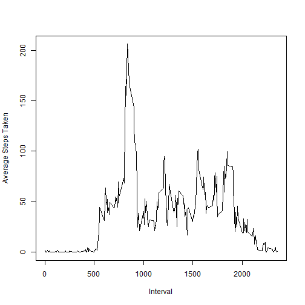

Assignment 1
========================================================

1) Loading and preprocessing the data
-------------------------------------


```r

rm(list = ls())
library(lubridate)
```

```
## Warning: package 'lubridate' was built under R version 3.0.3
```

```r
library(lattice)
library(sqldf)
```

```
## Loading required package: DBI
## Loading required package: gsubfn
## Loading required package: proto
## Loading required namespace: tcltk
## Loading required package: chron
## 
## Attaching package: 'chron'
## 
## The following objects are masked from 'package:lubridate':
## 
##     days, hours, minutes, seconds, years
## 
## Loading required package: RSQLite
## Loading required package: RSQLite.extfuns
```

```r

download.file(url = "http://d396qusza40orc.cloudfront.net/repdata%2Fdata%2Factivity.zip", 
    destfile = "activity.zip")
unzip("activity.zip", overwrite = T)

amd <- read.csv("activity.csv", header = T)
```


```r

## function FixNA2 ## -------------------------------------------- for any
## day that have NA values in the values of the steps, replace them with the
## average values of steps that are not NA for the same day
## --------------------------------------------
FixNA2 <- function(df) {
    size <- nrow(df)
    dfNoNA <- subset(df, !is.na(df$steps))
    
    for (i in (1:size)) {
        if (is.na(df$steps[i])) {
            sdf <- subset(dfNoNA, dfNoNA$date == df$date[i])
            avg <- ifelse(nrow(sdf) > 0, mean(sdf$steps), 0)
            df$steps[i] <- avg
        }
    }
    df
}

weekdays <- function(x) {
    y <- cbind(x, 1)
    for (i in (1:length(x))) {
        d <- wday(x[i])
        if (d == 1 || d == 7) 
            y[i, 2] <- 2
    }
    factor(y[, 2], labels = c("weekday", "weekend"), levels = c(1, 2))
}
```


#### main function for graphs and analysis.


```r

AnalyzeAndGraph <- function(df, plotHG, plotTS, plotPanel = F, printResult = T) {
    
    
    result <- sqldf(" select \n            date as steps_date,\n            sum(steps) as steps_sum,\n            avg(steps) as steps_mean\n          from \n            df\n          group by\n            date\n          ;     \n        ")
    
    if (printResult) 
        print(result)
    
    if (plotHG) 
        hist(result$steps_sum, xlab = "Daily Steps Total", main = "Histogram of Daily Steps Total")
    
    df.avg.step <- tapply(df$steps, df$interval, mean)
    
    max <- sort(df.avg.step, decreasing = T)[1]
    max <- round(max, digits = 2)
    
    cat(paste("Maximum numbers of average steps taken : ", max, "at", names(max), 
        "minutes, which is at", round(strtoi(names(max), base = 0L)/60, 2), 
        "hours"))
    
    
    if (plotTS) {
        ts <- sqldf("select avg(steps) as steps_mean, interval from df group by interval;")
        plot(x = ts$interval, y = ts$steps_mean, type = "l", xlab = "Interval", 
            ylab = "Average Steps Taken")
    }
    
    
    if (plotPanel) {
        library(ggplot2)
        ts <- sqldf("\n                    select\n                      interval, \n                      daytype,\n                      avg(steps) as steps_mean\n                    from \n                      df \n                    group by \n                      interval, \n                      daytype\n                    order by \n                      interval, \n                    daytype\n                    ;\n                  ")
        
        print(qplot(data = ts, x = interval, y = steps_mean, xlab = "Interval", 
            ylab = "Average Steps Taken", geom = "line", facets = daytype ~ 
                .))
    }
    
    return(result)
}

```


2) What is the mean total number of steps take per day?
-------------------------------------------------------


```r

data2 <- subset(amd, !is.na(amd$steps))
result2 <- AnalyzeAndGraph(data2, plotHG = T, plotTS = T)
```

```
## Loading required package: tcltk
```

```
##    steps_date steps_sum steps_mean
## 1  2012-10-02       126     0.4375
## 2  2012-10-03     11352    39.4167
## 3  2012-10-04     12116    42.0694
## 4  2012-10-05     13294    46.1597
## 5  2012-10-06     15420    53.5417
## 6  2012-10-07     11015    38.2465
## 7  2012-10-09     12811    44.4826
## 8  2012-10-10      9900    34.3750
## 9  2012-10-11     10304    35.7778
## 10 2012-10-12     17382    60.3542
## 11 2012-10-13     12426    43.1458
## 12 2012-10-14     15098    52.4236
## 13 2012-10-15     10139    35.2049
## 14 2012-10-16     15084    52.3750
## 15 2012-10-17     13452    46.7083
## 16 2012-10-18     10056    34.9167
## 17 2012-10-19     11829    41.0729
## 18 2012-10-20     10395    36.0938
## 19 2012-10-21      8821    30.6285
## 20 2012-10-22     13460    46.7361
## 21 2012-10-23      8918    30.9653
## 22 2012-10-24      8355    29.0104
## 23 2012-10-25      2492     8.6528
## 24 2012-10-26      6778    23.5347
## 25 2012-10-27     10119    35.1354
## 26 2012-10-28     11458    39.7847
## 27 2012-10-29      5018    17.4236
## 28 2012-10-30      9819    34.0938
## 29 2012-10-31     15414    53.5208
## 30 2012-11-02     10600    36.8056
## 31 2012-11-03     10571    36.7049
## 32 2012-11-05     10439    36.2465
## 33 2012-11-06      8334    28.9375
## 34 2012-11-07     12883    44.7326
## 35 2012-11-08      3219    11.1771
## 36 2012-11-11     12608    43.7778
## 37 2012-11-12     10765    37.3785
## 38 2012-11-13      7336    25.4722
## 39 2012-11-15        41     0.1424
## 40 2012-11-16      5441    18.8924
## 41 2012-11-17     14339    49.7882
## 42 2012-11-18     15110    52.4653
## 43 2012-11-19      8841    30.6979
## 44 2012-11-20      4472    15.5278
## 45 2012-11-21     12787    44.3993
## 46 2012-11-22     20427    70.9271
## 47 2012-11-23     21194    73.5903
## 48 2012-11-24     14478    50.2708
## 49 2012-11-25     11834    41.0903
## 50 2012-11-26     11162    38.7569
## 51 2012-11-27     13646    47.3819
## 52 2012-11-28     10183    35.3576
## 53 2012-11-29      7047    24.4688
```

 

```
## Maximum numbers of average steps taken :  206.17 at 835 minutes, which is at 13.92 hours
```

 

```r

NAdataset <- subset(amd, is.na(amd))
print(paste("Number of rows that have NA in it:", nrow(NAdataset)))
```

```
## [1] "Number of rows that have NA in it: 2304"
```


3) Imputing missing values (Replacing missing values with mean values of the day for steps)
-------------------------------------------------------------------------------------------


```r

data3 <- amd
data3 <- FixNA2(data3)
result3 <- AnalyzeAndGraph(data3, plotHG = T, plotTS = T)
```

```
##    steps_date steps_sum steps_mean
## 1  2012-10-01         0     0.0000
## 2  2012-10-02       126     0.4375
## 3  2012-10-03     11352    39.4167
## 4  2012-10-04     12116    42.0694
## 5  2012-10-05     13294    46.1597
## 6  2012-10-06     15420    53.5417
## 7  2012-10-07     11015    38.2465
## 8  2012-10-08         0     0.0000
## 9  2012-10-09     12811    44.4826
## 10 2012-10-10      9900    34.3750
## 11 2012-10-11     10304    35.7778
## 12 2012-10-12     17382    60.3542
## 13 2012-10-13     12426    43.1458
## 14 2012-10-14     15098    52.4236
## 15 2012-10-15     10139    35.2049
## 16 2012-10-16     15084    52.3750
## 17 2012-10-17     13452    46.7083
## 18 2012-10-18     10056    34.9167
## 19 2012-10-19     11829    41.0729
## 20 2012-10-20     10395    36.0938
## 21 2012-10-21      8821    30.6285
## 22 2012-10-22     13460    46.7361
## 23 2012-10-23      8918    30.9653
## 24 2012-10-24      8355    29.0104
## 25 2012-10-25      2492     8.6528
## 26 2012-10-26      6778    23.5347
## 27 2012-10-27     10119    35.1354
## 28 2012-10-28     11458    39.7847
## 29 2012-10-29      5018    17.4236
## 30 2012-10-30      9819    34.0938
## 31 2012-10-31     15414    53.5208
## 32 2012-11-01         0     0.0000
## 33 2012-11-02     10600    36.8056
## 34 2012-11-03     10571    36.7049
## 35 2012-11-04         0     0.0000
## 36 2012-11-05     10439    36.2465
## 37 2012-11-06      8334    28.9375
## 38 2012-11-07     12883    44.7326
## 39 2012-11-08      3219    11.1771
## 40 2012-11-09         0     0.0000
## 41 2012-11-10         0     0.0000
## 42 2012-11-11     12608    43.7778
## 43 2012-11-12     10765    37.3785
## 44 2012-11-13      7336    25.4722
## 45 2012-11-14         0     0.0000
## 46 2012-11-15        41     0.1424
## 47 2012-11-16      5441    18.8924
## 48 2012-11-17     14339    49.7882
## 49 2012-11-18     15110    52.4653
## 50 2012-11-19      8841    30.6979
## 51 2012-11-20      4472    15.5278
## 52 2012-11-21     12787    44.3993
## 53 2012-11-22     20427    70.9271
## 54 2012-11-23     21194    73.5903
## 55 2012-11-24     14478    50.2708
## 56 2012-11-25     11834    41.0903
## 57 2012-11-26     11162    38.7569
## 58 2012-11-27     13646    47.3819
## 59 2012-11-28     10183    35.3576
## 60 2012-11-29      7047    24.4688
## 61 2012-11-30         0     0.0000
```

 

```
## Maximum numbers of average steps taken :  179.13 at 835 minutes, which is at 13.92 hours
```

 

```r

comparison <- merge(x = result2, y = result3, by.x = "steps_date", by.y = "steps_date", 
    all.x = T, all.y = T)

comparison <- comparison[, c("steps_date", "steps_mean.x", "steps_mean.y")]
comparison$diff <- comparison$steps_mean.x - comparison$steps_mean.y

print(comparison)
```

```
##    steps_date steps_mean.x steps_mean.y diff
## 1  2012-10-01           NA       0.0000   NA
## 2  2012-10-02       0.4375       0.4375    0
## 3  2012-10-03      39.4167      39.4167    0
## 4  2012-10-04      42.0694      42.0694    0
## 5  2012-10-05      46.1597      46.1597    0
## 6  2012-10-06      53.5417      53.5417    0
## 7  2012-10-07      38.2465      38.2465    0
## 8  2012-10-08           NA       0.0000   NA
## 9  2012-10-09      44.4826      44.4826    0
## 10 2012-10-10      34.3750      34.3750    0
## 11 2012-10-11      35.7778      35.7778    0
## 12 2012-10-12      60.3542      60.3542    0
## 13 2012-10-13      43.1458      43.1458    0
## 14 2012-10-14      52.4236      52.4236    0
## 15 2012-10-15      35.2049      35.2049    0
## 16 2012-10-16      52.3750      52.3750    0
## 17 2012-10-17      46.7083      46.7083    0
## 18 2012-10-18      34.9167      34.9167    0
## 19 2012-10-19      41.0729      41.0729    0
## 20 2012-10-20      36.0938      36.0938    0
## 21 2012-10-21      30.6285      30.6285    0
## 22 2012-10-22      46.7361      46.7361    0
## 23 2012-10-23      30.9653      30.9653    0
## 24 2012-10-24      29.0104      29.0104    0
## 25 2012-10-25       8.6528       8.6528    0
## 26 2012-10-26      23.5347      23.5347    0
## 27 2012-10-27      35.1354      35.1354    0
## 28 2012-10-28      39.7847      39.7847    0
## 29 2012-10-29      17.4236      17.4236    0
## 30 2012-10-30      34.0938      34.0938    0
## 31 2012-10-31      53.5208      53.5208    0
## 32 2012-11-01           NA       0.0000   NA
## 33 2012-11-02      36.8056      36.8056    0
## 34 2012-11-03      36.7049      36.7049    0
## 35 2012-11-04           NA       0.0000   NA
## 36 2012-11-05      36.2465      36.2465    0
## 37 2012-11-06      28.9375      28.9375    0
## 38 2012-11-07      44.7326      44.7326    0
## 39 2012-11-08      11.1771      11.1771    0
## 40 2012-11-09           NA       0.0000   NA
## 41 2012-11-10           NA       0.0000   NA
## 42 2012-11-11      43.7778      43.7778    0
## 43 2012-11-12      37.3785      37.3785    0
## 44 2012-11-13      25.4722      25.4722    0
## 45 2012-11-14           NA       0.0000   NA
## 46 2012-11-15       0.1424       0.1424    0
## 47 2012-11-16      18.8924      18.8924    0
## 48 2012-11-17      49.7882      49.7882    0
## 49 2012-11-18      52.4653      52.4653    0
## 50 2012-11-19      30.6979      30.6979    0
## 51 2012-11-20      15.5278      15.5278    0
## 52 2012-11-21      44.3993      44.3993    0
## 53 2012-11-22      70.9271      70.9271    0
## 54 2012-11-23      73.5903      73.5903    0
## 55 2012-11-24      50.2708      50.2708    0
## 56 2012-11-25      41.0903      41.0903    0
## 57 2012-11-26      38.7569      38.7569    0
## 58 2012-11-27      47.3819      47.3819    0
## 59 2012-11-28      35.3576      35.3576    0
## 60 2012-11-29      24.4688      24.4688    0
## 61 2012-11-30           NA       0.0000   NA
```

### Conclusion: 
  1. after the NA values are replaced with the average values for the day, the only difference is the NA values are replaced with zero, since all the NAs are in the days were any other values are not present.
  2. all other days, the mean and median stay the same, as there are no NA values to be replaced.
  

4) Are there differences in activity patterns between weekdays and weekends? 
-----------------------------------------------------------------------------


```r

data4 <- data3
data4$daytype <- weekdays(data4$date)
dummy <- AnalyzeAndGraph(data4, plotHG = F, plotTS = F, plotPanel = T, printResult = F)
```

```
## Maximum numbers of average steps taken :  179.13 at 835 minutes, which is at 13.92 hours
```

 


### Conclusions: Yes, there are differences in activity patterns between weekdays and weekends. 

1. during the weekdays, there are two peaks during early morning and late afteroon (presumbly before going to work and shortly after work, assuming the time is utc time, rather than local time), with the early morining peaks much more pronounced.

2. in between the two peaks, activities are reduced.

3. during the weekend, activities are move evenly spread out during the day.
